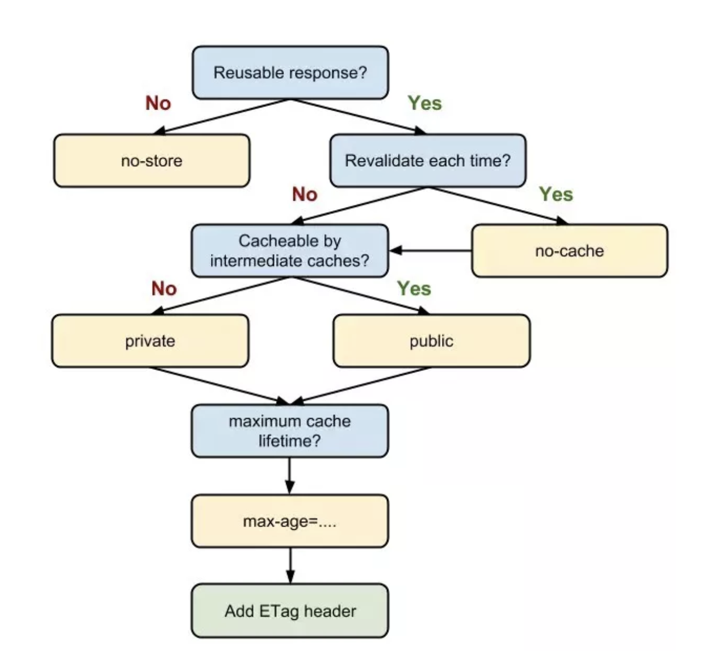

### 浏览器缓存策略
浏览器缓存机制有四个方面，他们按照获取资源是请求的优先级一次排列如下：
- Memory Cache
- Service Worker Cache
- HTTP Cache
- Push Cache

#### MemoryCache
MemoryCache，是指在内存中的缓存。从优先级上来说，他是浏览器最先尝试去命中的一种缓存。从效率上来说，它是响应速度最快的一种缓存。浏览器秉承的是“节约原则”，我们发现，Base64 格式的图片，几乎永远可以被塞进 Memory Cache ，这可以视作浏览器为节省渲染开销的“自保行为”；此外，体积不大的 JS 、 CSS 文件，也有较大的被写入内存的几率，相比较之下，较大的 JS 、CSS 文件就没有这个待遇了，内存资源是有限的，它们往往被直接甩进磁盘。

#### Service Worker Cache
Service Worker 是一种独立于主线程之外的 Javascript 线程。它脱离于浏览器窗体，因此无法直接访问 DOM 。这样的独立的个性使得 Service Woeker 的“个人行为”无法干预页面的性能，这个“幕后工作者”可以帮我们实现离线缓存、消息推送和网络代理等功能。我们借助 Service Worker 实现的离线缓存就称为 Service Worker Cache。

#### HTTP Cache
它又分为强缓存和协商缓存，在命中强缓存失败的情况下，才会走协商缓存。

对于一条 http get 报文的基本缓存处理过程包括 7 个步骤：
- 接收
- 解析
- 查询，缓存查看是否有本地副本可用，如果没有，就获取一份副本
- 新鲜度检测，缓存查看已缓存副本是否足够新鲜，如果不是，就询问服务器是和否有任何更新
- 创建响应，缓存会用新的首部和已缓存的主体来构建一条响应报文
- 发送，缓存通过网络将响应发回客户端
- 日志

#### 强缓存
强缓存是利用 HTTP 头中的 Expires 和 Cache-Control 两个字段来控制的。强缓存中，当请求再次发出时，浏览器会根据其中的 Expires 和 Cache-control 判断目标资源是否“命中”强缓存，若命中则直接从缓存中获取资源，不会再与服务器端发生通信。

是否足够新鲜时期：

通过 Expires：XXXX XXX XXX GMT （绝对日期时间，http/1.0）或者 Cache-Control：max-age=XXXX （相对日期时间，http/1.1）在文档标明过期日期。

Cache-Control 相对于 Expires 更加准确，它的优先级也更高。当 Cache-Control 与 Expires 同时出现时，我们以 Cache-Control 为准。

#### 关键字理解
public 与 private 是针对资源是否能够被代理服务缓存而存在的一组对立概念。如果我们为资源设置了 public，那么它既可以被浏览器缓存，也可以被代理服务器缓存；如果我们设置了 private，则该资源只能被浏览器缓存。private 为默认值。

no-store与no-cache，no-cache 绕开了浏览器：我们为资源设置了 no-cache 后，每一次发起请求都不会再去询问浏览器的缓存情况，而是直接向服务端去确认该资源是否过期（即走我们下文即将讲解的协商缓存的路线）。no-store 比较绝情，顾名思义就是不使用任何缓存策略。在 no-cache 的基础上，它连服务端的缓存确认也绕开了，只允许你直接向服务端发送请求、并下载完整的响应。

#### 协商缓存
协商缓存依赖于服务端与浏览器之间的通信。协商缓存机制下，浏览器需要向服务器去询问缓存的相关信息，进而判断是重新发起请求、下载完整的响应，还是从本地获取缓存的资源。如果服务端提示缓存资源未改动（Not Modified），资源会被重定向到浏览器缓存，这种情况下网络请求对应的状态码是 304。

协商缓存的实现：从 Last-Modified 到 Etag，详细自己百度，这里不再详细展开。

#### HTTP 缓存策略

当我们的资源内容不可复用时，直接为 Cache-Control 设置 no-store，拒绝一切形式的缓存；否则考虑是否每次都需要向服务器进行缓存有效确认，如果需要，那么设 Cache-Control 的值为 no-cache；否则考虑该资源是否可以被代理服务器缓存，根据其结果决定是设置为 private 还是 public；然后考虑该资源的过期时间，设置对应的 max-age 和 s-maxage 值；最后，配置协商缓存需要用到的 Etag、Last-Modified 等参数。

#### Push Cachae
Push Cache 是指 HTTP2 在 server push 阶段存在的缓存。
- Push Cache 是缓存的最后一道防线。浏览器只有在 Memory Cache、HTTP Cache 和 Service Worker Cache 均未命中的情况下才会去询问 Push Cache。
- Push Cache 是一种存在于会话阶段的缓存，当 session 终止时，缓存也随之释放。
- 不同的页面只要共享了同一个 HTTP2 连接，那么它们就可以共享同一个 Push Cache。

#### CDN
CDN 的核心点有两个，一个是缓存，一个是回源。

“缓存”就是说我们把资源 copy 一份到 CDN 服务器上这个过程，“回源”就是说 CDN 发现自己没有这个资源（一般是缓存的数据过期了），转头向根服务器（或者它的上层服务器）去要这个资源的过程。

CDN 往往被用来存放静态资源。所谓“静态资源”，就是像 JS、CSS、图片等不需要业务服务器进行计算即得的资源。而“动态资源”，顾名思义是需要后端实时动态生成的资源，较为常见的就是 JSP、ASP 或者依赖服务端渲染得到的 HTML 页面。

那“非纯静态资源”呢？它是指需要服务器在页面之外作额外计算的 HTML 页面。具体来说，当我打开某一网站之前，该网站需要通过权限认证等一系列手段确认我的身份、进而决定是否要把 HTML 页面呈现给我。这种情况下 HTML 确实是静态的，但它和业务服务器的操作耦合，我们把它丢到CDN 上显然是不合适的。

另外，CDN的域名必须和主业务服务器的域名不一样，要不，同一个域名下面的Cookie各处跑，浪费了性能流量的开销，CDN域名放在不同的域名下，可以完美地避免了不必要的 Cookie 的出现